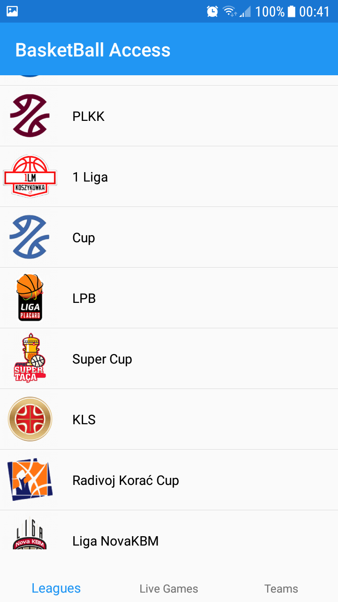
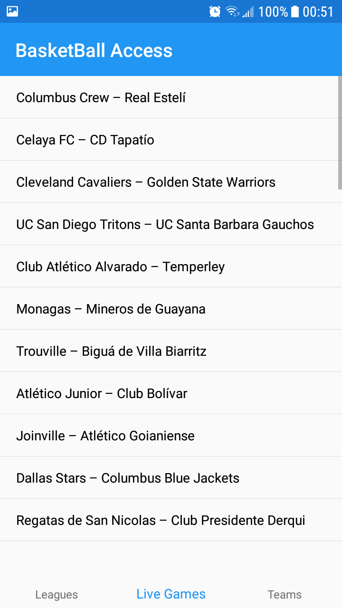
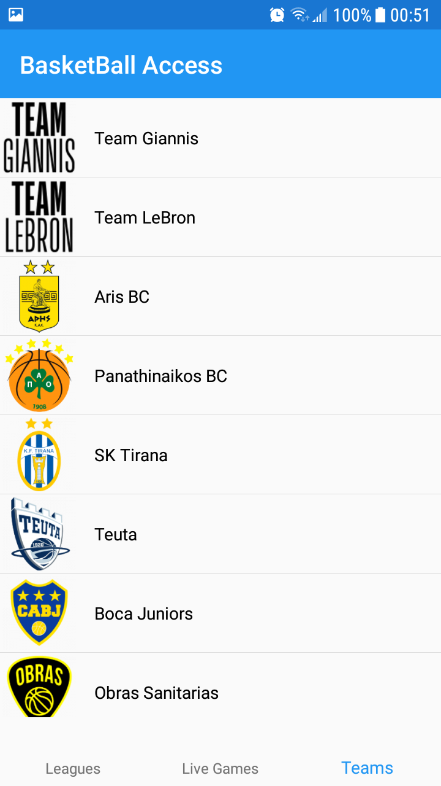
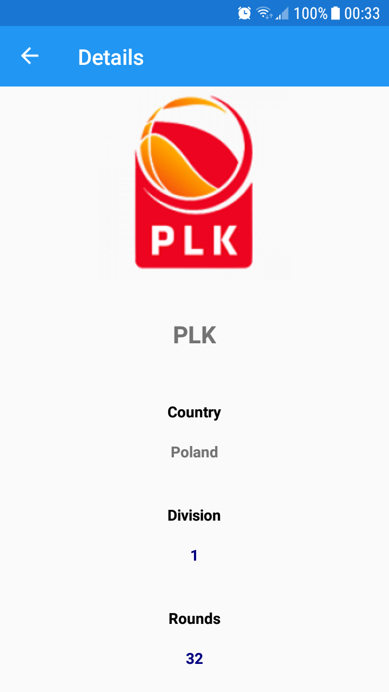

# BasketBall Data
Mobile app to access basketball leagues' data.
### Mockup
The project's mockup can be accessed in [Figma](https://www.figma.com/file/DntJ4V7qD6rAMLvr4zwLs3/Ludis-Virtual?node-id=0%3A1).
### Board
The project's requirements board can be accessed in [Trello](https://trello.com/b/6T5ufA8x/ludis-virtual).
### UI Screenshots
| | | |
|---|---|---|
 |  |  | 

### Team
- Eddinson Geronimo De La Rosa (1072957)
- Gabriel Alejandro Cruz Joa (1074387)
- Stefanny Lora (1074000)
### Libraries
- NETStandard.Library
- Newtonsoft.Json
- Prism.Unity.Forms
- PropertyChanged.Fody
- Xamarin.Essentials
- Xamarin.Forms
